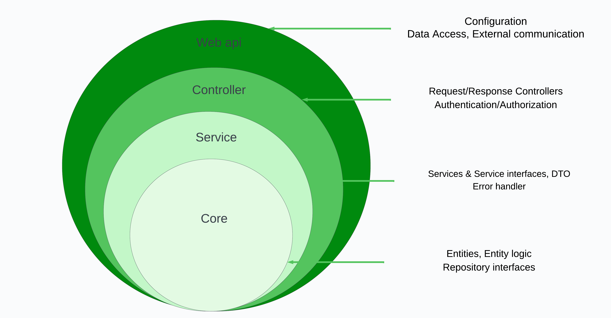
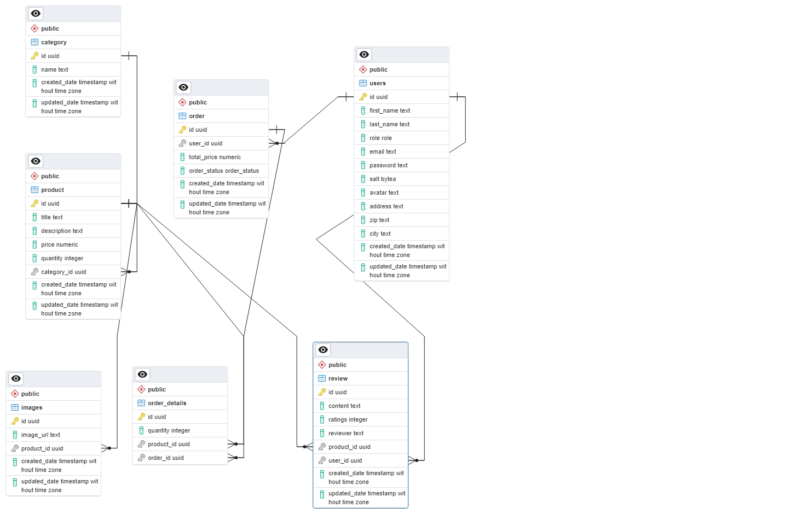

# Fullstack Project

## Table of Contents

1. [Project Overview](#project-overview)
2. [Features](#features)
3. [Project Setup Instructions](#project-setup-instructions)
4. [Testing](#testing)
5. [Architecture](#architecture)
6. [Database Design](#database-design)
7. [Endpoints](#endpoints)

## Project Overview

### Frontend

The frontend of the project has been deployed and is accessible in the repository at [https://github.com/hasanmd91/fs16_6-frontend-project](https://github.com/hasanmd91/fs16_6-frontend-project)

### Backend

This backend project is build wtih ASP.NET Core, Entity Framework Core, and PostgreSQL and is deployed on Microsoft Azure. The backend provides endpoints for performing CRUD operations based on Authorization.

### Technologies

- ASP.Net Core
- Entity Framework Core
- PostgreSql
- Xunit
- Microsoft Azure

## Features

#### User Management:

- Users can register for an account and log in.
- Self-registration as an admin is not permitted.
- Users can view all available products and individual product details.
- The ability to search and sort products is supported.
- Users can add products to their shopping cart.
- Cart management functionality is available.

#### Admin Functionalities

- Admins have the ability to view and delete user accounts.
- Product Management.
- Admins can view, edit, delete, and add new products.

## Project Setup Instructions

- Clone the Project
- Ensure that all required packages in every layer are installed according to the .csproj files. Navigate to each layer and execute:

```
dotnet restore
```

- Create a local appsettings.json file in the root directory of the project. You can use the provided template below and adjust it as necessary:

```
{
  "ConnectionStrings": {
    "localDb": "YOUR_DATABASE_CONNECTION_STRING_HERE"
  },
  "Jwt": {
    "Issuer": "YOUR_ISSUER_VALUE",
    "Audience": "YOUR_AUDIENCE_VALUE",
    "Key": "YOUR_SECRET_KEY_VALUE"
  }
}

```

- Insert your local database connection string under the "localDb" key in the appsettings.json file.
- Provide appropriate values for Issuer, Audience, and Key under the Jwt section in the appsettings.json file.
- Execute Entity Framework (EF) Core migrations to update the database schema. Navigate to the project containing the DbContext and execute:

```
dotnet ef migrations add <Migration_Name>
dotnet ef database update

```

- Navigate to the Ecom.WebAPI folder and run the project using either of the following commands:

```
dotnet run

```

## Testing

- To run all the tests, use the following command in the Test directory of the solution:

```
dotnet test

```

## Architecture



## DataBase Design



## Endpoints

#### Authentication

| Method | Path                |
| ------ | ------------------- |
| POST   | `/api/auth/login`   |
| GET    | `/api/auth/profile` |

#### Category

| Method | Path                         |
| ------ | ---------------------------- |
| GET    | `/api/category`              |
| POST   | `/api/category`              |
| GET    | `/api/category/{categoryId}` |
| DELETE | `/api/category/{categoryId}` |
| PATCH  | `/api/category/{categoryId}` |

#### Order

| Method | Path                   |
| ------ | ---------------------- |
| GET    | `/api/order`           |
| POST   | `/api/order`           |
| GET    | `/api/order/{orderId}` |
| DELETE | `/api/order/{orderId}` |
| PATCH  | `/api/order/{orderId}` |

#### Product

| Method | Path                       |
| ------ | -------------------------- |
| GET    | `/api/product`             |
| POST   | `/api/product`             |
| GET    | `/api/product/{productId}` |
| DELETE | `/api/product/{productId}` |
| PATCH  | `/api/product/{productId}` |

#### Review

| Method | Path                     |
| ------ | ------------------------ |
| POST   | `/api/review`            |
| DELETE | `/api/review/{reviewId}` |
| PATCH  | `/api/review/{reviewId}` |

#### User

| Method | Path                 |
| ------ | -------------------- |
| GET    | `/api/user`          |
| POST   | `/api/user`          |
| GET    | `/api/user/{userId}` |
| PATCH  | `/api/user/{userId}` |
| DELETE | `/api/user/{userId}` |
